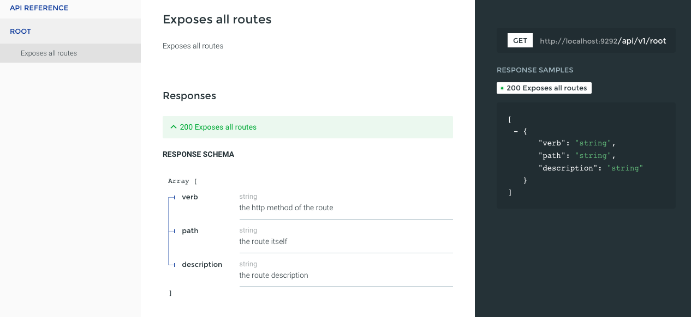

[](https://travis-ci.org/LeFnord/grape-starter)
[](https://badge.fury.io/rb/grape-starter)
[](http://inch-ci.org/github/LeFnord/grape-starter)


# Grape Starter

Is a tool to help you to build up a skeleton for a [Grape](http://github.com/ruby-grape/grape) API mounted on [Rack](https://github.com/rack/rack) ready to run.
[grape-swagger](http://github.com/ruby-grape/grape-swagger) would be used to generate a  [OAPI](https://github.com/OAI/OpenAPI-Specification/blob/master/versions/2.0.md) compatible documentation, which could be shown with [ReDoc](https://github.com/Rebilly/ReDoc).



## Why the next one?

- build up a playground for your ideas, prototypes, testing behaviour … whatever
- no assumtions about a backend/ORM, ergo no restrictions, only a pure grape/rack skeleton with a nice documentation

## Usage

#### Install it
```
$ gem install grape-starter
```


#### Create a new project
```
$ grape-starter new awesome_api
```
with following options:
```
-f, --force                # overwrites existend project
-p foobar, --prefix=foobar # provide a prefix under which the API can be accessed, default: api
-o sequel, --orm=sequel    # create also needed files and folders for the specified ORM
```

This command creates a folder named `awesome_api` containing the skeleton. With following structure:

```
├── <Standards>
├── api
│   ├── base.rb        # the main API class, all other endpoints would be mounted in it
│   ├── endpoints      # contains the endpoint file for a resource
│   │   └── root.rb    # root is always available, it exposes all routes/endpoints, disable by comment it out in base.rb
│   └── entities       # contains the entity representation of the reource, if wanted
│       └── route.rb
├── config             # base configuration
│   └── …
├── config.ru          # Rack it up
├── lib                # contains the additional lib file for a resource
│   ├── models
│   │   └── version.rb
│   └── models.rb
├── public             # for serving static files
│   └── redoc.html     # provides the ReDoc generated oapi documentation
├── script             # setup / server / test etc.
│   └── …
└── spec               # RSpec
    └── …
```

To run it, go into awesome_api folder, start the server
```
$ cd awesome_api
$ ./script/server *port
```
the API is now accessible under: [http://localhost:9292/api/v1/root](http://localhost:9292/api/v1/root)  
the documentation of it under: [http://localhost:9292/](http://localhost:9292/).

More could be found in [README](template/README.md).


#### Add resources
```
$ grape-starter add foo
```
with following options:
```
-e, --entity # a grape entity file will also be created
```
to add CRUD endpoints for resource foo. For more options, see `grape-starter add -h`.
This adds endpoint and lib file and belonging specs, and a mount entry in base.rb.


#### Remove a resource
```
$ grape-starter rm foo
```
to remove previous generated files for a resource.


## Contributing

Bug reports and pull requests are welcome on GitHub at https://github.com/LeFnord/grape-starter.


## License

The gem is available as open source under the terms of the [MIT License](LICENSE).
